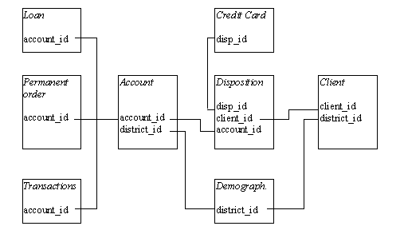
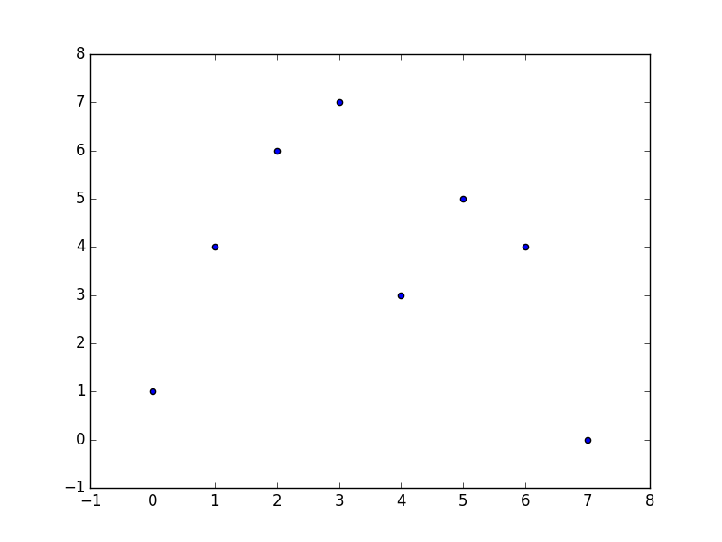
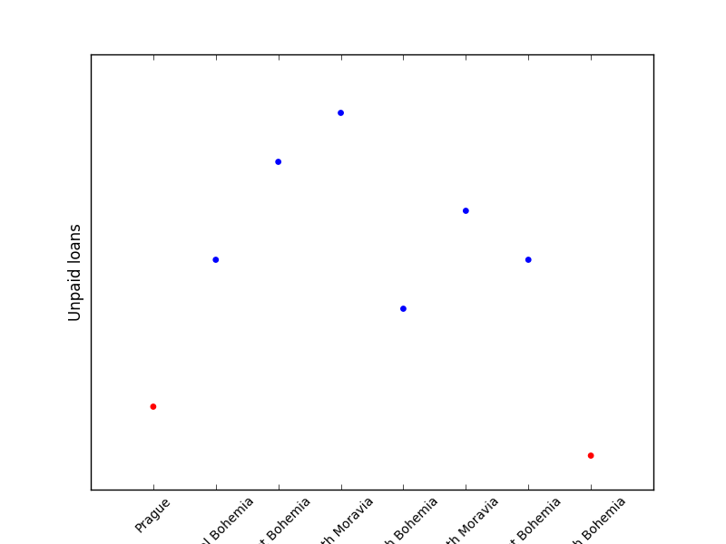

# Final work - Machine Learning Techniques

## Main goal
The objective of this work is to be able to predict regions with risk to have unpaid loans.

## Data description
The work has been based on the [financial data set](http://lisp.vse.cz/pkdd99/DATA/data_berka.zip) privided by the [PKDD’99 Discovery Challenge](http://lisp.vse.cz/pkdd99/Challenge/chall.htm). A complete guide to understand the data can be seen [here](http://lisp.vse.cz/pkdd99/berka.htm).

The data is composed by a set of files with .asc extension which was [parsed onto a database](src/ascToDb.py) at the beginning of the project.



## Accomplished work

Once the data was ready to work with it, the number of unpaid loans on each region was obtained by SQL sentences.

``` SQL
SELECT A3, COUNT(A3) FROM district WHERE A1 IN (
    SELECT district_id FROM account WHERE account_id IN (
        SELECT account_id FROM loan WHERE status='D'
    )
)
GROUP BY A3
```            

The result has been formatted on the following table.

|ID|Region|Number of unpaid loans|
|------|-------|-------------------|
|0|Prague|1|
|1|Central Bohemia|4|
|2|East Bohemia|0|
|3|North Moravia|7|
|4|South Bohemia|3|
|5|South Moravia|5|
|6|West Bohemia|4|
|7|North Bohemia|0|

And then it was plotted.



For accomplishing the clustering it was used the **Spectral algorithm** as it was known beforehand the number of clusters, 2, as it was needed one for regions with risk of unpaid loans and one for those without risk.

The result was plotted following graph, obtaining a **Silhouette Coefficient** of 0.602.



We can conclude that the regions on blue are under risk to suffer from unpaind loans.
